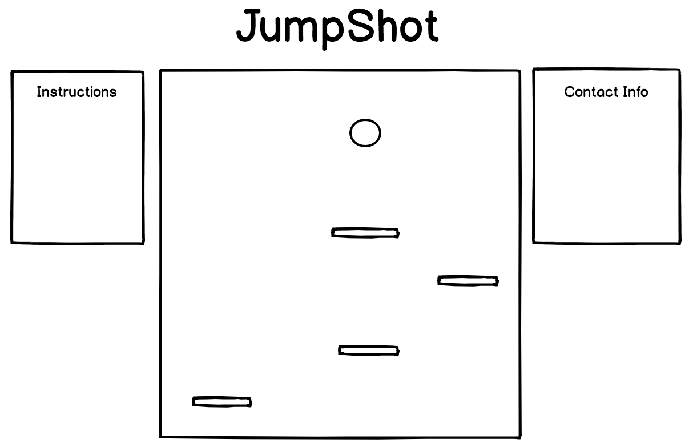

# Jumpshot

### MVPs
Jumpshot is an app that blends basketball and JavaScript together for maximum fun. The goal of the game is keep the ball bouncing higher and pass through hoops to score extra points. Don't go out of bounds!

### Technologies
Jumpshot utilizes vanilla JavaScript, HTML, CSS, and jQuery.

### Timeline
##### Phase 1 (Day 1 - 2)
Get the un-styled canvas up and a bounce-able, move-able ball working.
##### Phase 2 (Day 3)
Add the dribble platforms and hoops
##### Phase 3 (Day 4)
Add the styling to the background and ball

### Wireframe

