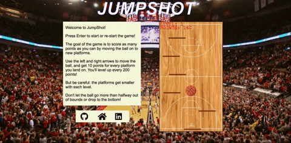

# JumpShot


### Introduction
JumpShot is an app that blends basketball and JavaScript together for maximum fun. The goal of the game is keep the ball bouncing higher and pass through hoops to score extra points. Don't go out of bounds!

[Play JumpShot!](http://robertoconnor.io/JumpShot/)


### Gameplay
After pressing enter to start, the player uses the left and right arrows to keep the basketball bouncing on platforms. Every new platform reached adds ten points to the score, and new levels are achieved every 200 points. But be careful! The platforms get smaller every level, and just like with the sport the ball can't go out of bounds.



### Technologies
JumpShot utilizes HTML's Canvas to render interactive objects on the screen. JavaScript and jQuery create the game cycle, physics, and points and bounds logic.

Several aspects are constantly checked: whether the ball is rising or falling, the positions of the ball and all the platforms, and whether the ball and a platform have collided.

The below function is applied to the ball when it reaches it peak. It checks if the the ball's y-coordinate on the canvas is above the canvas' floor. If it is, then the ball continues to "fall" by having its y-coordinate lowered. If not, then the "falling" condition is stopped.
```javascript
fallCon() {
  let ballContext = this.ball;

  if (ballContext.Y < height - ballContext.height) {
    ballContext.setPos(ballContext.X, ballContext.Y + ballContext.fallVel);
    ballContext.fallVel++;
  } else {
    ballContext.fallStop();
  }
}
```
